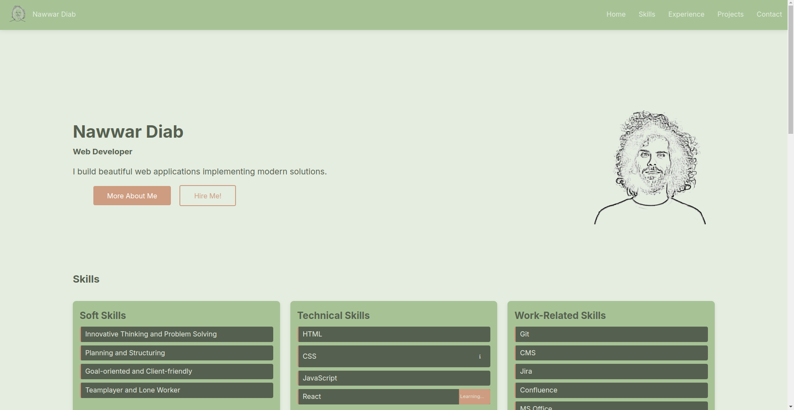

# Web Portfolio

A personal portfolio created as part of the UI Basics module, showcasing skills in HTML and CSS. This project focuses on responsive design and clean layouts.

## Features

- Responsive design
- Clean and modern layout
- Optimized for accessibility

## Technologies

- HTML5
- CSS3

## Preview

## Live Demo

[View the live project](https://nawardiab.github.io/my-web-portfolio/)

## Setup

1. Clone this repository:

`git clone https://github.com/nawardiab/my-web-portfolio.git`

2. Open `index.html` in a browser.

## Learning Outcomes

- Mastered responsive design techniques.
- Enhanced understanding of HTML5 semantics.
- Improved CSS layout skills.
